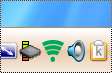
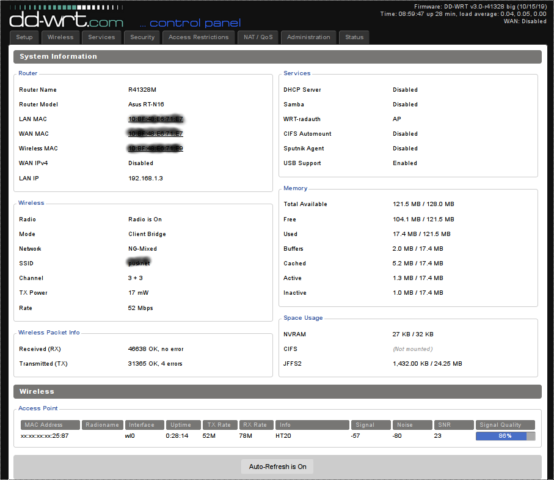
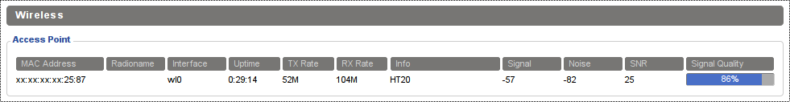

## SystemTray Icon for WiFi signal

| WiFi signal |  |
|:---:|---|
|  | SysTray Icon is a PyQt script for TDE (KDE 3.x) to depict WiFi signal strength on remote (networked) device | 

The remote device is usually a router (client, client/bridge, repeater, repeater/bridge mode) on local LAN segment 
to provide connectivity to another (adjancent) LAN segment. Due to nature of wifi there are fluctuations and collisions 
affecting the quality of this intersegment wifi link. Therefore is necessary to provide simple visual feedback of the 
link quality (rx/tx speed) to the user. The SysTray icon is the obvious solution.|  

### config

The current PyQt implementation is based on hardcoded config, however it is quite easy to read and edit Python code.

_Note: The separate ini-file based configuration is on TO-DO list._
 
### how it works

The algorithm is very simple: retrieve - process - diplay - repeat

* The script periodically queries the wifi status web page on remote device (dd-wrt info page)

| dd-wrt info page |
|:---:|
|  |

* The wireless AP information line is parsed and each column value is extracted

| dd-wrt info page - wifi Access Point details |
|:---:|
|  |

* A few other values (like Q, SN) are calculated from existing ones and actual Tooltip is constructed 

* Based on preconfigured signal lookup table the corresponding icon and optional audible sound are retrieved
  (Please note that audio notifications are not functional right now due to problems with QSound in PyQt4/5)

| systray icon | wifi signal level |
|:---:|---|
|  | signal level ERROR - error connecting to the remote monitored device (check tooltip tof more detailed error message) |
|  | signal level NOCON - remote monitored device online, but no connection to AP |
|  | signal level LOW |
|  | signal level MEDIUM |
|  | signal level HIGH |

* The new icon is rendered in the systray area with corresponding tooltip depicting more details

* There is a right-click menu with just two actions (for now)

    * refresh - force manual refresh of icon and tooltip (addtionally to periodical updates from QTimer)
    
    * exit - stop monitoring end exit (removes icon from systray)

| Tooltip and Right-click menu | |
|:---:|---|
|  | animated demo with all signal levels and tooltip plus right-click menu |

### implementation

The current implementation is intended for [TDE - Trinity Desktop Environment](http://www.trinitydesktop.org) as 
continuation of classic KDE 3.x (which was replaced by KDE 4/5 so all great KDE 3 achievements were lost). 
It might also work on other KDE based environments if they support [QSystrayIcon](http://qt.com/) class from Qt4/5.

There are two identical implementations in this repository:

* systray-wifi-qt4.py - PyQt4 / Python 2.7 for older 32-bit systems

* systray-wifi-qt5.py - PyQt5 / Python 3 for new 64-bit systems

### autostart

To start script automatically after login use symlink to ~/.config/Autostart/ directory

### to do

    TODO: debug why QSound() is not working
    TODO: intermittent visual artifcats (only on multiple runs, the 1st/2nd time the icon is ok):
    TODO: open minimalistic web browser with dd-wrt info page from right-click menu entry
    TODO: store long term statistics and provide signal strength plot

### keywords

TDE, Trinity Desktop, KDE3, Qt, PyQt4, PyQt5, Python, icon, SysTray, dd-wrt